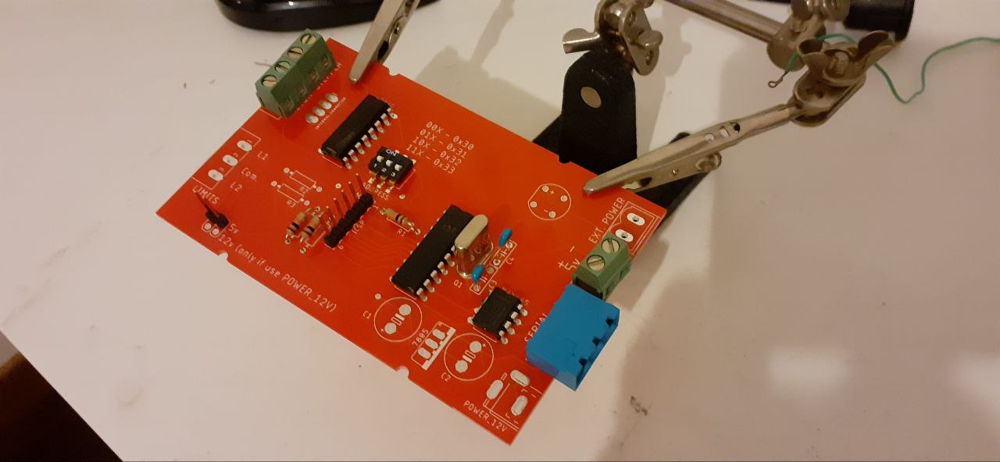
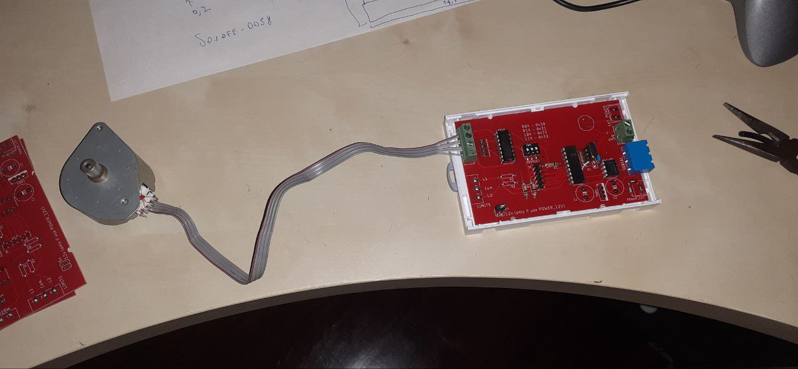

This board, designed with KiCad 9.0 and programmed with MPLAB X, is capable of driving a bipolar stepper motor (such as those used in printers).

It is programmed to be controlled via a standard RS-485 interface with a custom protocol but is already prepared to be integrated into a larger network of boards with hardware addressing and a standard protocol (such as Modbus).  
  
  
  
Currently, to control the motor, simply send the character '1' to move it clockwise or '2' to move it counterclockwise. As feedback, the board will send back the character '5' (ACK).